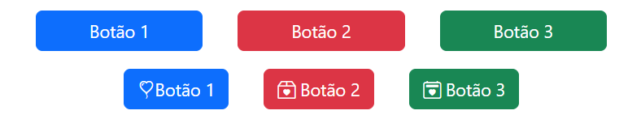
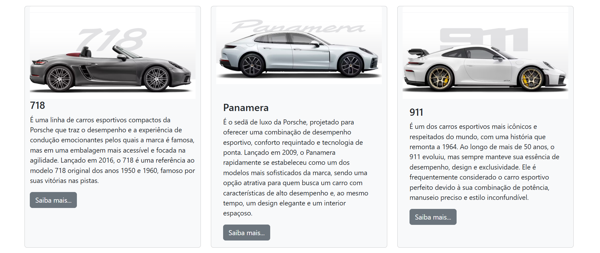

# Exemplos de Uso do Framework Bootstrap 🚀

Este repositório contém diversos *exemplos práticos* demonstrando como utilizar o framework **Bootstrap** para criar interfaces modernas e responsivas com facilidade. Se você está começando com o Bootstrap ou busca referências para melhorar seus projetos, esse repositório é o lugar certo! 💻📱

## O que é o Bootstrap? 🤔

[Bootstrap](https://getbootstrap.com/) é um dos frameworks front-end mais populares e amplamente utilizados para o desenvolvimento de interfaces responsivas. Ele oferece um conjunto de *componentes prontos*, *estilos* e *javascripts* para criar websites rápidos e com um visual profissional. O Bootstrap facilita a criação de layouts fluidos e adaptáveis a qualquer tipo de dispositivo.

## Estrutura do Repositório 📂

O repositório contém exemplos em diferentes seções, que incluem:

* **Componentes Básicos**: Exemplos de botões, formulários, barras de navegação, etc.
* **Layouts Responsivos**: Demonstrações de grids e containers responsivos.
* **Utilitários**: Exemplos do uso de classes utilitárias do Bootstrap.
* **Modais e Alertas**: Como criar modais, pop-ups e alertas interativos.
* **Cards**: Exemplos de como usar o componente de cards para exibir conteúdo de forma organizada.

## Como Usar 👨‍💻

1. Clone o repositório:
   ```bash
   git clone https://github.com/SesiSenaiDA2025/bootstrap-exemplos-de-uso.git
   ```

2. Acesse o diretório:
   ```bash
   cd bootstrap-exemplos-de-uso
   ```

3. Abra o arquivo HTML desejado no seu navegador para ver o exemplo em ação! 🌐

*Dica*: Se você preferir rodar os exemplos localmente com um servidor, pode usar o *Live Server* do VSCode ou algum outro servidor local de sua preferência.

## Licença 📜

Esse projeto está licenciado sob a licença **MIT**. Veja o arquivo LICENSE para mais detalhes.

## Exemplos de Tela 📸

1. *Exemplo de Botões*:


2. *Exemplo de Card*:


## Contato 📬

Se você tiver alguma dúvida ou sugestão, fique à vontade para me contatar diretamente através do meu e-mail: nathalia.leite@aluno.senai.br

*Desenvolvido por SENAI/SESI 2DA | 2025*

